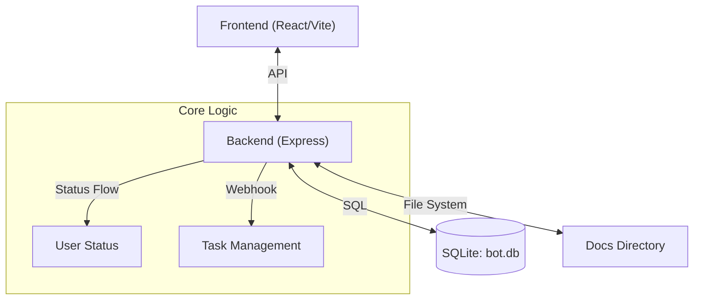

# Claw Dashboard

---

一個簡潔、高效的本地 AI Agent 儀表板，整合了任務管理、狀態追蹤與自動化文件同步功能。

核心理念：**所有 Agent 行為都必須可視化、可追蹤、可回放**，形成 `Agent` → `Status` → `Task` → `Docs` → `UI` 的完整閉環系統。

---

## 🚀 快速開始

### 📥 安裝與 Clone

將專案 Clone 到 `.openclaw/workspace` 目錄下：

```bash
mkdir -p .openclaw/workspace
cd .openclaw/workspace
git clone git@github.com:Ry7no/ClawDashboard.git
cd ClawDashboard
```

### ⚡ 一行啟動

專案內建自動化啟動腳本，首次運行會自動安裝依賴：

```bash
chmod +x start.sh && ./start.sh
```

啟動後會自動開啟瀏覽器，訪問 `http://localhost:5173`。

### 🧠 初始化長期記憶 (Long Memory Init)

啟動後，請與 OpenClaw 溝通，下達以下指令以建立長期記憶：

> "請去 `.openclaw/workspace/ClawDashboard/backend/docs` 讀取裡面的兩篇 `.md` 檔案，做相應的處理並且存入長記憶中。"

---

### 🛠️ 手動安裝與啟動

如果你偏好手動控制：

**1. 啟動後端 (Backend)**

```bash
cd backend
npm install
# 確保 .env 存在 (可參考 .env.example)
cp .env.example .env
node server.js
```

後端預設運行在 `http://localhost:3001`。

**2. 啟動前端 (Frontend)**

```bash
cd frontend
npm install
npm run dev
```

前端預設運行在 `http://localhost:5173`。

---

## 🏗️ 系統架構



---

## 🧩 核心概念與工作流

### 1. Status Flow (狀態燈)

系統透過狀態燈即時反映 Agent 目前的運作情形。

- **三種狀態**：
    - `idle`: 閒置中，等待指令。
    - `thinking`: 收到任務，正在規劃或思考。
    - `acting`: 正在執行具體操作。
- **自動化規則**：
    1.  收到任務 → 狀態轉為 `thinking`
    2.  開始執行 → 狀態轉為 `acting`
    3.  任務完成 → 狀態回歸 `idle`

### 2. Long Memory & Task Flow (長期記憶與任務看板)

所有的對話與指令都會被轉化為結構化的 Task，並記錄在看板上。

- **Task 建立規則**：
    - **Title**: 摘要（第一行，≤120字）
    - **Description**: 全文內容
- **狀態流轉**：
    - `todo` (Received): 收到 Webhook 請求
    - `in_progress` (Started): 任務開始執行
    - `done` (Completed): 任務結束

### 3. Docs System (文件系統)

文件是 Agent 知識與記憶的載體。

- **Workspace Root**: `path.join(__dirname, '../../..', 'workspace')`
- **分類**：
    - **System**: Workspace 下的 `.md` 文件（唯讀）
    - **Docs**: `backend/docs` 目錄下的文件（可讀寫，用於記錄 Integration Log 等）

---

## 🔌 API 參考文獻

### Status API

管理 Agent 的當前狀態。

| Method | Endpoint | Description |
| :--- | :--- | :--- |
| `GET` | `/api/status` | 獲取當前狀態與活躍 Agent |
| `PUT` | `/api/status` | 更新狀態 (`state`: `idle`/`thinking`/`acting`) |

### Task API

任務看板的 CRUD 操作。

| Method | Endpoint | Description |
| :--- | :--- | :--- |
| `GET` | `/api/tasks` | 獲取任務列表 |
| `POST` | `/api/tasks` | 建立新任務 |
| `PUT` | `/api/tasks/:id` | 更新任務內容或狀態 |

### Webhook API (自動化驅動)

外部系統透過此接口驅動 Dashboard 的狀態與任務流轉。

- **Endpoint**: `POST /api/webhook/message`
- **Payload**:
  ```json
  {
    "text": "...",         // 任務內容
    "stage": "received",   // 階段: received | started | completed
    "taskId": "optional"   // 用於追蹤同一任務的後續階段
  }
  ```
- **行為對應**:
    - `received` → 建立 `todo` Task
    - `started` → 更新 Task 為 `in_progress`
    - `completed` → 更新 Task 為 `done`

### Agent API

- **Endpoint**: `GET /api/agents`
- **Description**: 讀取 `openclaw.json` (位於 Workspace 上層)，回傳可用 Agent 列表。

---

## ⚙️ 環境變數 (Environment Variables)

設定檔位於 `backend/.env`：

| 變數 | 預設值 | 說明 |
| :--- | :--- | :--- |
| `PORT` | 3001 | Backend 服務端口 |
| `DB_PATH` | bot.db | SQLite 資料庫路徑 |
| `DOCS_DIR` | docs | 文件存放目錄名稱 |

---

## 📝 License

MIT
