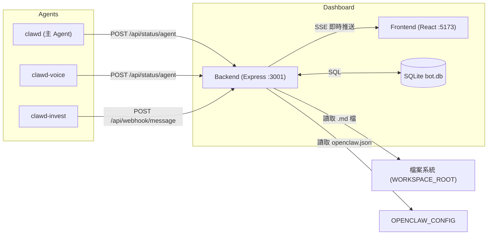

# 🦞 Claw Dashboard

一個專為 AI Agent 設計的即時儀表板，讓 Agent 的所有行為**可視化、可追蹤、可回放**。

核心閉環：`Agent` → `Status` → `Task` → `Docs` → `UI`

---

# tbdavid2019修正

1. CORS 阻擋 LAN 存取 ✅
server.js 的 CORS 設定只允許 localhost，LAN 模式 http://10.0.0.10:5173 打 API 直接被擋。現在讀 CORS_ORIGINS 環境變數，預設 * 全開。

2. 所有 hardcode 路徑移除 ✅
setup.sh 裡 5 處 hardcode ~/.openclaw/workspace/ClawDashboard 全部換成 find_project_dir() 自動偵測：

先看 當前目錄
再看 script 自己的位置
再看 PM2 執行路徑
最後才 fallback 到常見位置
所以不管裝在 /home/david/project/clawd/ClawDashboard 還是哪裡，cd 進去就能用。

3. 安裝位置不再強制
新安裝時 clone 到 當前目錄（不再強制 ~/.openclaw/workspace/）。


## ✨ 功能一覽 (Features)

### 🖥️ 即時狀態面板 (Real-time Dashboard)
- **多 Agent 並行追蹤** — 同時顯示多個 Agent（Coder、Architect、Reviewer…）的即時狀態
- **三色狀態燈** — `idle` 閒置（綠）、`thinking` 思考中（黃色呼吸燈）、`acting` 執行中（紅）
- **SSE 即時推播** — 所有狀態變更即時反映到前端，無需手動刷新

### 📋 任務看板 (Task Kanban)
- **Webhook 驅動** — 外部系統（如 Telegram Bot）可自動建立、更新任務
- **狀態流轉** — `todo` → `in_progress` → `done`
- **任務優先級** — 支援排序與手動調整
- **批次刪除** — 一鍵清理已完成任務

### 📄 文件 / 知識庫 (Docs & Knowledge Base)
- **雙來源整合** — 顯示 `backend/docs/` 的可編輯文件 + `workspace/` 下的 Markdown 唯讀文件
- **文件釘選 & 排序** — 重要文件置頂
- **線上編輯** — 直接在 Dashboard 中編輯、建立文件
- **檔案上傳** — 支援上傳 Markdown 檔案
- **Agent 長期記憶載體** — 文件即知識，Agent 可讀取建立記憶

### 📊 模型用量追蹤 (Model Usage Tracker)
- 追蹤各 AI Provider / Model 的用量百分比
- 支援 CD (Cooldown) 計時顯示

### 🔌 Webhook & API 整合
- **Webhook 自動任務化** — `POST /api/webhook/message` 自動將訊息轉為 Task
- **完整 REST API** — Status / Task / Docs / Agent / Models / Logs / Sync
- **資料匯入匯出** — `GET /api/sync/export` / `POST /api/sync/import`

### 🌐 其他
- **i18n 多語言** — 支援中文 / English 界面切換
- **Server-Sent Events (SSE)** — 全局事件匯流排，前端即時更新
- **SQLite 輕量儲存** — 零配置資料庫，單檔 `bot.db`
- **跨平台部署** — Linux (x86 / ARM / Raspberry Pi) + macOS
- **一鍵安裝** — `setup.sh` 全自動（含 OS 偵測、Port 衝突處理、防火牆檢查）

## 🚀 快速開始

---

### 🤖 方式一：讓 AI Agent 幫你裝（推薦）

複製以下提示詞，貼給你的 AI Agent（OpenClaw 或其他）：

#### 📋 中文提示詞 — 安裝

```
請幫我安裝 Claw Dashboard。

安裝前請先問我兩件事：
1. 我想要「本地模式」（只有這台電腦可看到）還是「區網模式」（其他電腦也能連進來看）？
2. 我的 Agent 工作目錄在哪裡？（例如 /home/david/project/clawd、~/.openclaw/workspace）

確認後請執行：
1. 執行：bash <(curl -sSL https://raw.githubusercontent.com/tbdavid2019/ClawDashboard/main/setup.sh) --local --workspace /用戶提供的路徑 或 --lan --workspace /用戶提供的路徑
2. 如果有錯誤，讀取 ClawDashboard/backend/docs/Troubleshooting.md 排除問題
3. 安裝完成後，讀取 ClawDashboard/backend/docs/ 下所有 .md 檔並存入長記憶
4. 告訴我 Dashboard 網址

重要：
- Frontend port = 5173（Vite）、Backend port = 3001，不要亂改
- Port 衝突腳本會自動處理
- 支援 Linux（x86/ARM/Raspberry Pi）和 macOS
```

#### 📋 English Prompt — Install

```
Please install Claw Dashboard for me.

Before installing, ask me:
1. Do I want "local mode" (only this machine) or "LAN mode" (other machines can connect)?
2. Where is my Agent workspace directory? (e.g. /home/david/project/clawd, ~/.openclaw/workspace)

Then run:
1. bash <(curl -sSL https://raw.githubusercontent.com/tbdavid2019/ClawDashboard/main/setup.sh) --local --workspace /user-provided-path  (or --lan)
2. On errors, read ClawDashboard/backend/docs/Troubleshooting.md
3. After install, read all .md in ClawDashboard/backend/docs/ → save to long memory
4. Tell me the Dashboard URL

Important:
- Frontend port = 5173 (Vite), Backend port = 3001 — do NOT change these
- Port conflicts are auto-resolved by the script
- Supports Linux (x86/ARM/Raspberry Pi) and macOS
```

#### 📋 更新 / 切換 / 移除 (Update / Switch / Uninstall)

> **注意**：以下指令請先 `cd` 到 ClawDashboard 的安裝目錄再執行。

| 場景 | 指令 |
|:---|:---|
| 🔄 更新到最新版 | `bash setup.sh --update` |
| 📋 查看狀態 | `bash setup.sh --status` |
| 🔀 切換到區網模式 | `bash setup.sh --switch-lan` |
| 🔀 切換到本地模式 | `bash setup.sh --switch-local` |
| 🗑️ 完全移除 | `bash setup.sh --uninstall` |

**移除後請告訴 AI Agent（重要！避免記憶污染）：**

```
請清除所有 ClawDashboard 相關的長期記憶：
1. 刪除 memory/ 下所有 claw-dashboard 相關檔案
2. 從 MEMORY.md 移除 ClawDashboard 相關索引
3. 確認記憶已清理乾淨
```

---

### 🧑‍💻 方式二：手動安裝

#### 📥 Step 1: Clone

```bash
# Clone 到你想要的位置 (任意目錄皆可)
git clone https://github.com/tbdavid2019/ClawDashboard.git
cd ClawDashboard
```

#### ⚡ Step 2: 啟動

```bash
# 前景啟動（開發用，Ctrl+C 停止）
chmod +x start.sh && ./start.sh

# 或 PM2 背景啟動（正式部署推薦）
./start.sh --bg
```

#### 🌐 Step 3: 網路配置（如需區網存取）

預設**只有本機可連**。如需從其他電腦存取，修改 `backend/.env`：

```bash
HOST=0.0.0.0
```

重啟服務後，從其他電腦打開 `http://<主機IP>:5173`。

#### 🔁 Step 4: 開機自啟（可選）

```bash
./start.sh --boot
pm2 save
```

#### 🧠 Step 5: 初始化長期記憶

告訴 OpenClaw：

> "請去 `~/.openclaw/workspace/ClawDashboard/backend/docs` 讀取裡面的 `.md` 檔案，做相應的處理並存入長記憶中。"

---

### 📋 管理指令

| 指令 | 功能 |
| :--- | :--- |
| **安裝 & 啟動** | |
| `bash setup.sh` | 互動式安裝（會問 local/LAN）|
| `bash setup.sh --local` | 安裝（本地模式）|
| `bash setup.sh --lan` | 安裝（區網模式）|
| `./start.sh --bg` | PM2 背景啟動 |
| `./start.sh --boot` | 設定開機自啟 |
| **日常管理** | |
| `bash setup.sh --status` | 查看狀態、URL、DB 大小 |
| `bash setup.sh --update` | 更新到最新版並重啟 |
| `bash setup.sh --switch-lan` | 切換到區網模式 |
| `bash setup.sh --switch-local` | 切換到本地模式 |
| `./start.sh --stop` | 停止服務 |
| `pm2 logs` | 即時日誌 |
| `pm2 restart all` | 重啟服務 |
| **移除** | |
| `bash setup.sh --uninstall` | 停止 + 備份 DB + 刪除 |

---

## 🏗️ 系統架構 — Dashboard 是被動的

Dashboard **不會主動去問 Agent 狀態**。所有資料都是 Agent 主動回報或從檔案系統讀取。



---

## 🧩 資料來源與運作原理

Dashboard 的四大資料來源，缺任何一個就少一塊拼圖：

### 1. Agent 列表 — 從 `openclaw.json` 讀取

```
GET /api/agents → 讀取 OPENCLAW_CONFIG 指向的 openclaw.json
```

只拿 agent 名字列表，顯示在 sidebar。Dashboard 不管 agent 裝在哪裡、跑什麼程式。

### 2. Agent 即時狀態 — Agent 主動回報 (API)

```bash
# 個別 Agent 回報自己的狀態
curl -X POST http://localhost:3001/api/status/agent \
  -H "Content-Type: application/json" \
  -d '{"name": "clawd-voice", "state": "acting"}'

# 設定全域狀態 + 目前活躍的 Agent
curl -X PUT http://localhost:3001/api/status \
  -H "Content-Type: application/json" \
  -d '{"state": "thinking", "activeAgent": "clawd-invest"}'
```

三種狀態：`idle`（閒置）→ `thinking`（規劃中）→ `acting`（執行中）

**如果 Agent 沒有打這些 API，Dashboard 上的狀態燈就不會動。**

### 3. 任務看板 — 透過 Webhook 驅動

```bash
# 新任務進來
curl -X POST http://localhost:3001/api/webhook/message \
  -H "Content-Type: application/json" \
  -d '{"text": "幫我翻譯這份文件", "stage": "received"}'

# 任務開始
curl -X POST http://localhost:3001/api/webhook/message \
  -H "Content-Type: application/json" \
  -d '{"stage": "started", "taskId": 1}'

# 任務完成
curl -X POST http://localhost:3001/api/webhook/message \
  -H "Content-Type: application/json" \
  -d '{"stage": "completed", "taskId": 1}'
```

| stage | 動作 |
|:---|:---|
| `received` | 建立新 Task（狀態 `todo`）|
| `started` | Task 狀態變 `in_progress` |
| `completed` | Task 狀態變 `done` |

### 4. 文件瀏覽 — 遞迴掃描 WORKSPACE_ROOT

設定 `WORKSPACE_ROOT=/home/david/project`，Dashboard 會遞迴掃描該目錄下所有 `.md` 檔案：

```
/home/david/project/          ← WORKSPACE_ROOT
├── clawd/MEMORY.md            ✅ 顯示
├── clawd-voice/README.md      ✅ 顯示
├── clawd-invest/notes.md      ✅ 顯示
├── ClawDashboard/             ⚠️ 只讀 records/ 子目錄
└── node_modules/              ❌ 自動排除
```

自動排除的目錄：`node_modules`、`.git`、`dist`、`build` 等。

---

## 🔌 API 參考文獻

### Status API

管理 Agent 的當前狀態。

| Method | Endpoint | Description |
| :--- | :--- | :--- |
| `GET` | `/api/status` | 獲取當前狀態、活躍 Agent 與所有 Agent 個別狀態 |
| `PUT` | `/api/status` | 更新全域狀態 (`state`: `idle`/`thinking`/`acting`) |
| `POST` | `/api/status/agent` | 更新個別 Agent 狀態 (`name` + `state`) |

### Task API

任務看板的 CRUD 操作。

| Method | Endpoint | Description |
| :--- | :--- | :--- |
| `GET` | `/api/tasks` | 獲取任務列表 |
| `POST` | `/api/tasks` | 建立新任務 |
| `PUT` | `/api/tasks/:id` | 更新任務內容或狀態 |

### Webhook API (自動化驅動)

外部系統透過此接口驅動 Dashboard 的狀態與任務流轉。

- **Endpoint**: `POST /api/webhook/message`
- **Payload**:
  ```json
  {
    "text": "...",         // 任務內容
    "stage": "received",   // 階段: received | started | completed
    "taskId": "optional"   // 用於追蹤同一任務的後續階段
  }
  ```
- **行為對應**:
    - `received` → 建立 `todo` Task
    - `started` → 更新 Task 為 `in_progress`
    - `completed` → 更新 Task 為 `done`

### Agent API

- **Endpoint**: `GET /api/agents`
- **Description**: 讀取 `openclaw.json` (位於 Workspace 上層)，回傳可用 Agent 列表。

---

## ⚙️ 環境變數 (Environment Variables)

### Backend (`backend/.env`)

| 變數 | 預設值 | 說明 |
| :--- | :--- | :--- |
| `PORT` | `3001` | Backend 服務端口 |
| `HOST` | `127.0.0.1` | 綁定地址。`0.0.0.0` = 區網可存取 |
| `DB_PATH` | `bot.db` | SQLite 資料庫路徑 |
| `DOCS_DIR` | `docs` | 文件存放目錄名稱 |
| `CORS_ORIGINS` | `*` | CORS 白名單。`*` = 允許全部，或逗號分隔的來源列表 |
| `OPENCLAW_CONFIG` | (自動偵測) | `openclaw.json` 路徑，用於 Agent 列表。自動搜尋 `.openclaw/` 目錄 |
| `WORKSPACE_ROOT` | (自動偵測) | Docs 頁籤讀取的根目錄。自動使用 `.openclaw/workspace/` |

### Frontend (`frontend/.env`)

| 變數 | 預設值 | 說明 |
| :--- | :--- | :--- |
| `VITE_API_URL` | (自動偵測) | 覆蓋 API 位址，例如 `http://10.0.0.10:3001` |
| `VITE_BACKEND_PORT` | `3001` | 覆蓋後端端口 |

---

## ⚠️ 已知問題與設計限制 (Known Issues)

此專案為 MVP 等級，以下為已知的架構瑕疵，計劃在 ClawDashboard2 中重新設計解決。

### 1. 被動架構 — Agent 必須主動打 API

Dashboard 不會主動偵測 Agent 狀態。每個 Agent 必須自己呼叫 `POST /api/status/agent` 和 `POST /api/webhook/message` 來回報。

**問題**：如果 Agent 沒有被教會打這些 API，Dashboard 就是一片空白。

**理想做法**：Dashboard 應主動掃描檔案系統（監控各 workspace 的檔案變動、讀取 agent log），無需 Agent 配合。

### 2. 新 Agent 不會自動知道 Dashboard

安裝 Dashboard 後，只有 main agent 讀了 `backend/docs/*.md` 知道怎麼整合。
日後新增的 sub-agent **不會自動繼承這些知識**。

**問題**：新建 clawd-newagent 後，它完全不知道要回報狀態給 Dashboard。

**目前 workaround**：在 main agent 的 `MEMORY.md` 裡加規則——「建立新 sub-agent 時，必須告訴它 Dashboard API 用法」。

### 3. 已完成 Task 無限積累

所有 Task 永久保存在 SQLite `bot.db`，沒有自動清理機制。
長期使用後 DB 會持續增長。

**問題**：沒有自動歸檔、過期刪除、或「清除已完成」按鈕。

**目前 workaround**：手動刪除 — `sqlite3 bot.db "DELETE FROM tasks WHERE status='done'"`

---

### 感謝原作者
[Ry7no/ClawDashboard](https://github.com/Ry7no/ClawDashboard)
