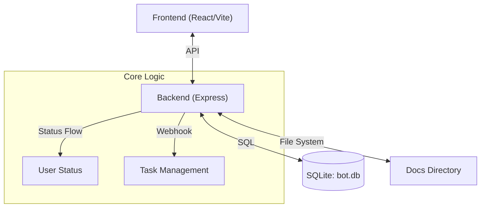

# 🦞 Claw Dashboard

一個簡潔、高效的本地 AI Agent 儀表板，整合了任務管理、狀態追蹤與自動化文件同步功能。

核心理念：**所有 Agent 行為都必須可視化、可追蹤、可回放**，形成 `Agent` → `Status` → `Task` → `Docs` → `UI` 的完整閉環系統。


# tbdavid2019更改

已升級為 **Multi-Agent Team View (多重 Agent 並行視角)**，不再侷限於單一 Agent 的狀態顯示。

### ✨ 新增功能
1.  **並行狀態追蹤 (Concurrency Tracking)**
    -   後端新增 `agent_states` 資料表，可獨立記錄每個 Agent (如 `Coder`, `Architect`, `Reviewer`) 的即時狀態。
    -   即使多個 Agent 同時工作，狀態燈也能正確反映各自的進度。

2.  **視覺化升級 (Visual Enhancements)**
    -   **Thinking (思考中)**: 新增黃色呼吸燈動畫 🟡，與執行中的紅色燈號 🔴 做區隔。
    -   側邊欄現在會優先顯示個別 Agent 的狀態，而非全域狀態。

3.  **API 更新**
    -   `POST /api/status/agent`: 供 Agent 回報個別狀態。
    -   `GET /api/status`: 回傳資料新增 `agents` 欄位，包含所有成員的最新動態。

## 🚀 快速開始

### 感謝原作者
[Ry7no/ClawDashboard](https://github.com/Ry7no/ClawDashboard)

---

### 🤖 方式一：讓 AI Agent 幫你裝（推薦）

複製以下提示詞，貼給你的 AI Agent（OpenClaw 或其他）：

<details>
<summary>📋 中文提示詞 (Chinese Prompt)</summary>

> 請幫我安裝 Claw Dashboard。
>
> **安裝前請先問我：**
> 1. 我想要「本地模式」（只有這台電腦可看到）還是「區網模式」（其他電腦也能連進來看）？
>
> **確認後請執行：**
> 1. 執行安裝指令：`bash <(curl -sSL https://raw.githubusercontent.com/tbdavid2019/ClawDashboard/main/setup.sh) --local` 或 `--lan`（根據我的選擇）
> 2. 如果安裝過程有任何錯誤，請讀取 `~/.openclaw/workspace/ClawDashboard/backend/docs/Troubleshooting.md` 來排除問題
> 3. 安裝完成後，讀取 `~/.openclaw/workspace/ClawDashboard/backend/docs/` 下所有 `.md` 檔案並存入長記憶
> 4. 告訴我 Dashboard 的存取網址
>
> **注意事項：**
> - Frontend port 固定為 5173（Vite），Backend port 固定為 3001
> - 如果遇到 port 衝突，腳本會自動處理；如果仍有問題，查看 Troubleshooting.md
> - 支援 Linux (x86/ARM/Raspberry Pi) 和 macOS

</details>

<details>
<summary>📋 English Prompt</summary>

> Please install Claw Dashboard for me.
>
> **Before installing, ask me:**
> 1. Do I want "local mode" (only this machine can access) or "LAN mode" (other machines on the network can connect)?
>
> **After I answer, run:**
> 1. Run: `bash <(curl -sSL https://raw.githubusercontent.com/tbdavid2019/ClawDashboard/main/setup.sh) --local` or `--lan` (based on my choice)
> 2. If any errors occur, read `~/.openclaw/workspace/ClawDashboard/backend/docs/Troubleshooting.md` for solutions
> 3. After installation, read all `.md` files in `~/.openclaw/workspace/ClawDashboard/backend/docs/` and save to long memory
> 4. Tell me the Dashboard URL
>
> **Notes:**
> - Frontend port is 5173 (Vite), Backend port is 3001
> - The script auto-handles port conflicts; if issues persist, see Troubleshooting.md
> - Supports Linux (x86/ARM/Raspberry Pi) and macOS

</details>

---

### 🧑‍💻 方式二：手動安裝

#### 📥 Step 1: Clone

```bash
mkdir -p ~/.openclaw/workspace
cd ~/.openclaw/workspace
git clone https://github.com/tbdavid2019/ClawDashboard.git
cd ClawDashboard
```

#### ⚡ Step 2: 啟動

```bash
# 前景啟動（開發用，Ctrl+C 停止）
chmod +x start.sh && ./start.sh

# 或 PM2 背景啟動（正式部署推薦）
./start.sh --bg
```

#### 🌐 Step 3: 網路配置（如需區網存取）

預設**只有本機可連**。如需從其他電腦存取，修改 `backend/.env`：

```bash
HOST=0.0.0.0
```

重啟服務後，從其他電腦打開 `http://<主機IP>:5173`。

#### 🔁 Step 4: 開機自啟（可選）

```bash
./start.sh --boot
pm2 save
```

#### 🧠 Step 5: 初始化長期記憶

告訴 OpenClaw：

> "請去 `~/.openclaw/workspace/ClawDashboard/backend/docs` 讀取裡面的 `.md` 檔案，做相應的處理並存入長記憶中。"

---

### 📋 PM2 管理指令

| 指令 | 功能 |
| :--- | :--- |
| `./start.sh --bg` | 背景啟動 |
| `./start.sh --stop` | 停止服務 |
| `./start.sh --status` | 查看狀態 |
| `./start.sh --boot` | 設定開機自啟 |
| `pm2 logs` | 即時日誌 |
| `pm2 restart all` | 重啟服務 |

---

## 🏗️ 系統架構



---

## 🧩 核心概念與工作流

### 1. Status Flow (狀態燈)

系統透過狀態燈即時反映 Agent 目前的運作情形。

- **三種狀態**：
    - `idle`: 閒置中，等待指令。
    - `thinking`: 收到任務，正在規劃或思考。
    - `acting`: 正在執行具體操作。
- **多 Agent 支援**：每個 Agent 可獨立回報狀態，前端會分別顯示。
- **自動化規則**：
    1.  收到任務 → 狀態轉為 `thinking`
    2.  開始執行 → 狀態轉為 `acting`
    3.  任務完成 → 狀態回歸 `idle`

### 2. Long Memory & Task Flow (長期記憶與任務看板)

所有的對話與指令都會被轉化為結構化的 Task，並記錄在看板上。

- **Task 建立規則**：
    - **Title**: 摘要（第一行，≤120字）
    - **Description**: 全文內容
- **狀態流轉**：
    - `todo` (Received): 收到 Webhook 請求
    - `in_progress` (Started): 任務開始執行
    - `done` (Completed): 任務結束

### 3. Docs System (文件系統)

文件是 Agent 知識與記憶的載體。

- **Workspace Root**: `path.join(__dirname, '../../..', 'workspace')`
- **分類**：
    - **System**: Workspace 下的 `.md` 文件（唯讀）
    - **Docs**: `backend/docs` 目錄下的文件（可讀寫，用於記錄 Integration Log 等）

---

## 🔌 API 參考文獻

### Status API

管理 Agent 的當前狀態。

| Method | Endpoint | Description |
| :--- | :--- | :--- |
| `GET` | `/api/status` | 獲取當前狀態、活躍 Agent 與所有 Agent 個別狀態 |
| `PUT` | `/api/status` | 更新全域狀態 (`state`: `idle`/`thinking`/`acting`) |
| `POST` | `/api/status/agent` | 更新個別 Agent 狀態 (`name` + `state`) |

### Task API

任務看板的 CRUD 操作。

| Method | Endpoint | Description |
| :--- | :--- | :--- |
| `GET` | `/api/tasks` | 獲取任務列表 |
| `POST` | `/api/tasks` | 建立新任務 |
| `PUT` | `/api/tasks/:id` | 更新任務內容或狀態 |

### Webhook API (自動化驅動)

外部系統透過此接口驅動 Dashboard 的狀態與任務流轉。

- **Endpoint**: `POST /api/webhook/message`
- **Payload**:
  ```json
  {
    "text": "...",         // 任務內容
    "stage": "received",   // 階段: received | started | completed
    "taskId": "optional"   // 用於追蹤同一任務的後續階段
  }
  ```
- **行為對應**:
    - `received` → 建立 `todo` Task
    - `started` → 更新 Task 為 `in_progress`
    - `completed` → 更新 Task 為 `done`

### Agent API

- **Endpoint**: `GET /api/agents`
- **Description**: 讀取 `openclaw.json` (位於 Workspace 上層)，回傳可用 Agent 列表。

---

## ⚙️ 環境變數 (Environment Variables)

### Backend (`backend/.env`)

| 變數 | 預設值 | 說明 |
| :--- | :--- | :--- |
| `PORT` | `3001` | Backend 服務端口 |
| `HOST` | `127.0.0.1` | 綁定地址。`0.0.0.0` = 區網可存取 |
| `DB_PATH` | `bot.db` | SQLite 資料庫路徑 |
| `DOCS_DIR` | `docs` | 文件存放目錄名稱 |
| `CORS_ORIGINS` | `*` | CORS 白名單。`*` = 允許全部，或逗號分隔的來源列表 |

### Frontend (`frontend/.env`)

| 變數 | 預設值 | 說明 |
| :--- | :--- | :--- |
| `VITE_API_URL` | (自動偵測) | 覆蓋 API 位址，例如 `http://10.0.0.10:3001` |
| `VITE_BACKEND_PORT` | `3001` | 覆蓋後端端口 |

---

## 📝 License

MIT

